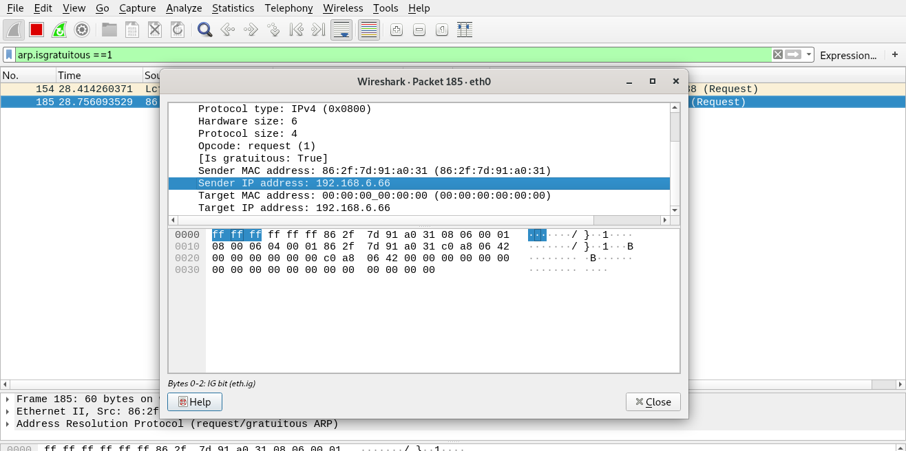

### 获取静态IP的方法

在很多场景中，能与IOT设备通过网线直连，但是不知道IOT设备的IP地址，可以通过以下两种方法获取。

- ARP 扫描
向C端的所有IP发送ARP请求，根据是否有响应来确定设备的静态IP地址。此脚本用于自动发现**C段**下对端IOT设备的**静态IP**。

此方法属于主动扫描，无需重启目标设备。

```bash
root@kali:~# ./static-ip-finder.sh -i eth0 -p 192.168
BEGIN AT: Mon 16 Sep 2019 10:23:24 AM EDT
[#                                                  ]2%
192.168.6.66	86:2f:7d:91:a0:31	(Unknown)
[##################################################]100%
FINISH AT: Mon 16 Sep 2019 10:32:01 AM EDT

```

- ARP Gratuitous

利用在静态IP生效之前需要探测是否存在冲突特性，通过在测机上抓包获取。PC 直连 IOT 设备后,在PC端抓包过滤ARP包（arp.isgratuitous == 1）,并重启设备，在捕获的数据包中获取静态IP地址。

此方法属于被动监听，但需要重启目标设备。



